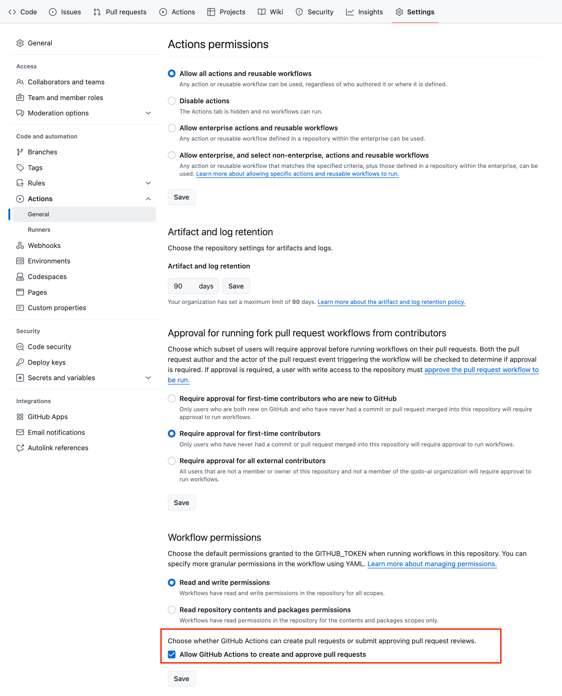
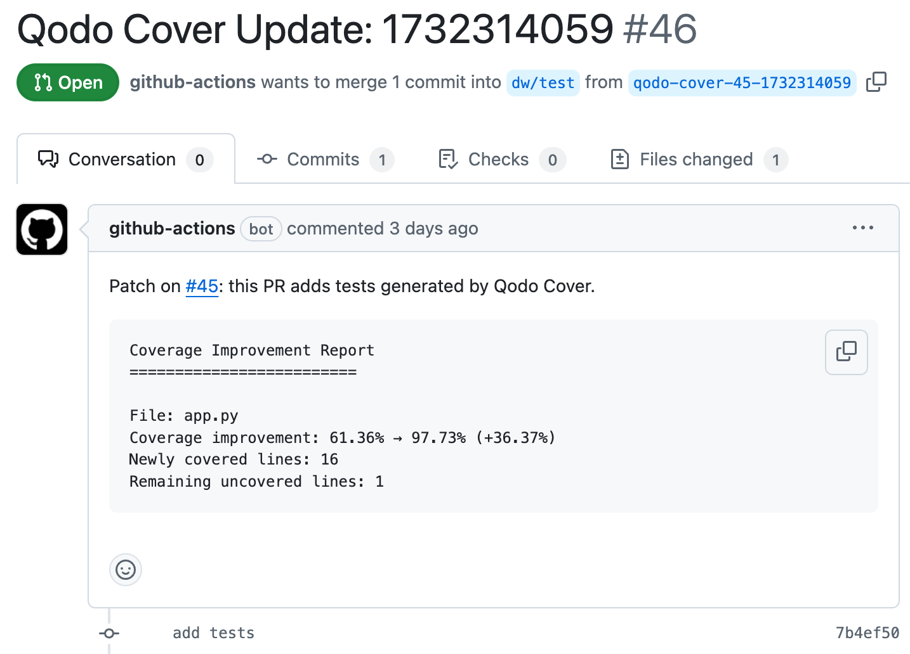

# Qodo Cover GitHub Action

*Currently in preview and available for free for a limited time.*

> **Note**: Qodo Cover provides **two** GitHub Actions:
> 1. **qodo-cover** – Best used with manual workflow dispatch. Expands all the tests it can find.
> 2. **qodo-cover-pr** – Best used for pull-request-based test generation. Improves coverage for modified files.

Both actions help automatically generate and enhance test coverage using AI-powered test generation. Qodo Cover analyzes your existing test coverage and intelligently generates additional tests to improve coverage while ensuring high-quality, meaningful test cases.

---

## Features

* 🔍 Analyzes existing test coverage to identify gaps  
* 🤖 Uses AI to generate contextually aware test cases  
* ✅ Ensures generated tests execute successfully and pass assertions  
* 📈 Targets uncovered code paths to maximize coverage  
* 🔄 Iterative test generation with configurable attempts  
* 🎯 Configurable coverage threshold

### Supported Languages

* Python
* PHP
* Java
* Go
* Kotlin
* Javascript
* Typescript
* *More coming soon!*

---

## Prerequisites

### Repository Permissions

For Qodo Cover to work, you must explicitly allow GitHub Actions to create pull requests.  
This setting can be found under:  
**Settings** > **Actions** > **General** > **Workflow permissions**.

Ensure **"Allow GitHub Actions to create and approve pull requests"** is enabled.



### Repository secret

Add `OPENAI_API_KEY` to your [repository secrets](https://docs.github.com/en/actions/security-for-github-actions/security-guides/using-secrets-in-github-actions#creating-secrets-for-a-repository).

**Note:** This requirement is temporary. We will enable users to issue access tokens from their Qodo Portal in a future release.

---

## Usage

### 1. qodo-cover (Manual Workflow Dispatch)

See this [working example](https://github.com/qodo-ai/qodo-ci-example/blob/main/.github/workflows/qodo-cover-python.yml) or add the following to your workflow file:

```yaml
name: Run the qodo-cover action

on:
  workflow_dispatch:
    inputs:
      desired_coverage:
        description: "Desired coverage percentage"
        required: false
        default: "70"

permissions:
  pull-requests: write # Allows commenting on pull requests
  contents: write # Allows reading and writing files

jobs:
  run-qodo-cover:
    runs-on: ubuntu-22.04
    steps:
      - name: Check out repo
        uses: actions/checkout@v3

      # ... set up your environment, e.g., install dependencies, etc.

      - name: qodo-cover
        uses: qodo-ai/qodo-ci/.github/actions/qodo-cover@v0.1.12
        with:
          github_token: ${{ secrets.GITHUB_TOKEN }}
          branch: ${{ github.ref_name }}
          project_language: python
          project_root: .
          code_coverage_report_path: ./coverage.xml
          coverage_type: cobertura
          test_command: "pytest --cov=. --cov-report=xml --cov-report=term" # your test command
          model: gpt-4o-2024-11-20
          max_iterations: 3
          desired_coverage: 90
          run_each_test_separately: true
          source_folder: .
          test_folder: .
          additional_instructions: "generated tests MUST be prefixed by a comment that says 'This test was generated by Qodo Cover'"
        env:
          OPENAI_API_KEY: ${{ secrets.OPENAI_API_KEY }}
```

#### Inputs (qodo-cover)

| Input                      | Description                                                                                                                                      | Required | Default           |
|----------------------------|--------------------------------------------------------------------------------------------------------------------------------------------------|----------|-------------------|
| `github_token`            | GitHub token for authentication                                                                                                                  | **Yes**  | N/A               |
| `branch`                  | The branch to run on and potentially open a PR against                                                                                          | **Yes**  | N/A               |
| `project_language`        | Language of the project                                                                                                                          | No       | `python`          |
| `project_root`            | Root directory of the project                                                                                                                    | No       | `.`               |
| `code_coverage_report_path` | Path to the coverage.xml (or equivalent) coverage file                                                                                        | No       | `./coverage.xml`  |
| `coverage_type`           | Type of coverage report (e.g. `cobertura`, `jacoco`)                                                                                            | No       | `cobertura`       |
| `test_command`            | Command to run tests (must generate coverage.xml)                                                                                                | **Yes**  | N/A               |
| `model`                   | LLM model name, e.g. `gpt-4o`                                                                                                                   | No       | `gpt-4o`          |
| `max_iterations`          | Maximum number of test generation attempts per file                                                                                             | No       | `3`               |
| `desired_coverage`        | Target coverage percentage                                                                                                                      | No       | `100`             |
| `run_each_test_separately`| Whether to run tests individually for improved speed                                                                                        | No       | `true`            |
| `source_folder`           | Path, relative to `project_root`, to look for source files. Will ignore source files outside this folder.                                        | No       | `.`               |
| `test_folder`             | Path, relative to `project_root`, to look for test files. Will ignore test files outside this folder.                                            | No       | `.`               |
| `additional_instructions` | Additional instructions you wish to append at the end of the test generation prompt.                                                             | No       | `generated tests MUST be prefixed by a comment that says 'This test was generated by Qodo Cover'` |

---

### 2. qodo-cover-pr (Pull Request-based Action)

See this [working example](https://github.com/qodo-ai/qodo-ci-example/blob/main/.github/workflows/qodo-cover-pr-python.yml) or add the following to your workflow file:

```yaml
name: Run the qodo-cover-pr action

on:
  pull_request:
    branches:
      - main
    types:
      - labeled

permissions:
  pull-requests: write  # Allows commenting on pull requests
  contents: write  # Allows reading files and creating pull requests

jobs:
  run-qodo-cover-pr-python:
    # Only run if:
    # 1. PR has the qodo-cover label
    # 2. PR is open (not closed or draft)
    if: |
      contains(github.event.label.name, 'qodo-cover') &&
      github.event.pull_request.state == 'open' &&
      github.event.pull_request.draft == false
    runs-on: ubuntu-22.04
    steps:
      - name: Check out repo
        uses: actions/checkout@v3

      # ... set up your environment, e.g., install dependencies, etc.

      - name: qodo-cover-pr
        uses: qodo-ai/qodo-ci/.github/actions/qodo-cover-pr@v0.1.12
        with:
          github_token: ${{ secrets.GITHUB_TOKEN }}
          project_language: python
          project_root: .
          code_coverage_report_path: ./coverage.xml
          coverage_type: cobertura
          test_command: "pytest --cov=. --cov-report=xml --cov-report=term" # your test command
          model: gpt-4o-2024-11-20
          max_iterations: 3
          desired_coverage: 100
          run_each_test_separately: true
          source_folder: .
          test_folder: .
          additional_instructions: "Make sure all tests include detailed docstrings explaining what they're testing"
        env:
          OPENAI_API_KEY: ${{ secrets.OPENAI_API_KEY }}
```

When this action runs on a pull request, it analyzes the changes in that PR, generates additional tests if needed, and will open a new "patch PR" onto your original PR that contains newly created tests.

#### Inputs (qodo-cover-pr)

| Input                      | Description                                                                                                                                      | Required | Default          |
|----------------------------|--------------------------------------------------------------------------------------------------------------------------------------------------|----------|------------------|
| `github_token`            | GitHub token for authentication                                                                                                                  | **Yes**  | N/A              |
| `project_language`        | Language of the project                                                                                                                          | No       | `python`         |
| `project_root`            | Root directory of the project                                                                                                                    | No       | `.`              |
| `diff_coverage`           | When true, only target coverage for lines in the diff                                                                                            | No       | `false`              |
| `branch`                  | The base branch to compare to for diff_coverage                                                                                                  | No       | `main`              |
| `code_coverage_report_path` | Path to the coverage.xml (or equivalent) coverage file                                                                                        | No       | `./coverage.xml` |
| `coverage_type`           | Type of coverage report (e.g. `cobertura`, `jacoco`)                                                                                            | No       | `cobertura`      |
| `test_command`            | Command to run tests (must generate coverage.xml)                                                                                                | **Yes**  | N/A              |
| `model`                   | LLM model name, e.g. `gpt-4o`                                                                                                                   | No       | `gpt-4o`         |
| `max_iterations`          | Maximum number of test generation attempts per file                                                                                             | No       | `3`              |
| `desired_coverage`        | Target coverage percentage                                                                                                                      | No       | `100`            |
| `run_each_test_separately`| Whether to run tests individually for improved speed                                                                                        | No       | `true`           |
| `source_folder`           | Path, relative to `project_root`, to look for source files. Will ignore source files outside this folder.                                        | No       | `.`              |
| `test_folder`             | Path, relative to `project_root`, to look for test files. Will ignore test files outside this folder.                                            | No       | `.`              |
| `additional_instructions` | Additional instructions you wish to append at the end of the test generation prompt.                                                             | No       | `generated tests MUST be prefixed by a comment that says 'This test was generated by Qodo Cover'` |

---

## Outputs

If the Qodo Cover agent succeeds in improving coverage it will comment on your PR with a link to a patch PR containing the new tests.



---

## Limitations

* Must run on ubuntu-22.04 x64
* Will only add test cases to existing test files
* You must provide a test command that produces coverage reports in Cobertura or Jacoco XML format (e.g. with pytest and pytest-cov)
* You must provide your own OpenAI API key

---

## Roadmap

* [ ] Support QodoAI auth so user doesn't have to bring their own LLM API key
* [x] Option to only generate tests that are focused on the user's PR changeset
* [ ] Integration with Qodo Merge and Qodo Gen
* [x] Support for additional languages (Typescript, Golang, Java, etc.) and coverage formats (e.g. Cobertura, JaCoCo)
* [ ] Support workflows for other CI providers (Jenkins, CircleCI, Travis CI, and more)
